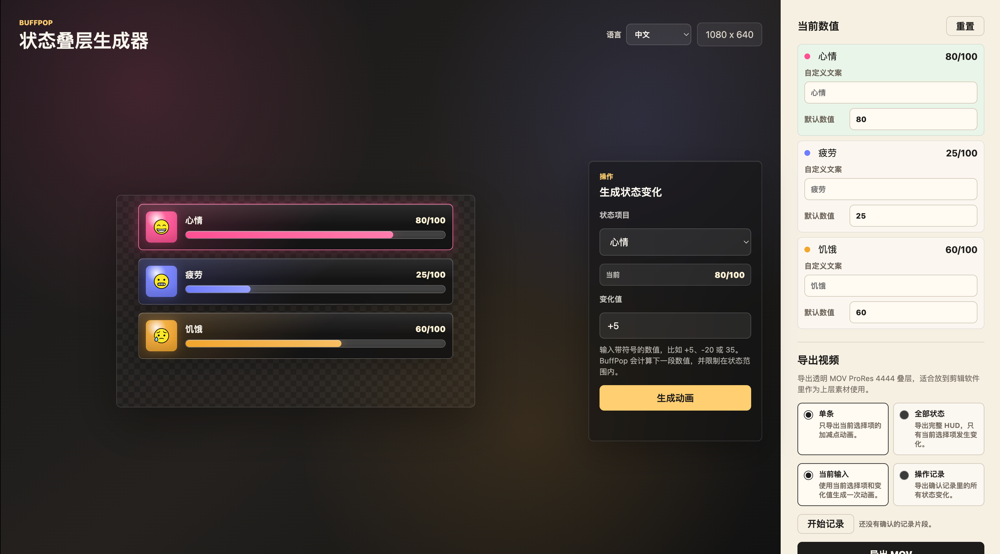

# BuffPop

BuffPop 是一个面向短视频剪辑的状态条叠层视频生成器。它用网页表单配置游戏化 HUD，例如心情、疲劳、饥饿这类 0-100 状态条，再把数值变化做成带透明通道的视频素材，方便放到剪映、Premiere、Final Cut 等剪辑软件里作为上层叠加素材使用。



## 这个项目解决什么问题

很多短视频会在实拍画面上叠加“游戏 UI”效果，例如人物当前心情、疲劳值、饥饿感的变化。专业软件当然能做，但为了一个 `80 -> 85` 的状态条动画去学完整的 PS/PR 动效流程，成本偏高。

BuffPop 的目标是把这类重复动效变成可配置工具：

- 选择一个状态，例如 `心情`。
- 输入变化值，例如 `+5` 或 `-20`。
- 页面实时预览进度条从旧值线性变化到新值。
- 导出透明 MOV 视频。
- 在剪辑软件中把导出文件放到原视频上层，当作叠层素材。

## 当前功能

- 三个默认状态：`心情`、`疲劳`、`饥饿`。
- 每个状态支持自定义文案。
- 每个状态支持直接调整默认数值，用作下一次动画的起点。
- 支持 `+5`、`-20`、`35` 这类整数变化输入。
- 自动限制数值范围，避免低于 0 或超过最大值。
- 进度条动画使用线性变化，适合剪辑叠加。
- 0、低值、高值、满值会有不同展示状态。
- 表情图标按 10 点粒度切换，饥饿也使用人物表情类图标。
- 支持单条状态导出和完整 HUD 导出。
- 支持记录一段操作，把多个状态变化合并成一次完整 HUD 导出。
- 默认中文界面，同时提供英文切换。

## 基本使用流程

1. 在右侧“当前数值”里设置每个状态的初始数值和自定义文案。
2. 在 HUD 右侧的“生成状态变化”表单里选择状态。
3. 输入变化值，例如 `+5`。
4. 点击“生成动画”，页面会预览状态条变化，并更新当前数值。
5. 选择导出范围：
   - `单条`：只导出当前选择项的动画。
   - `全部状态`：导出完整 HUD，只有发生变化的状态动起来。
6. 选择变化来源：
   - `当前输入`：导出当前这一次变化。
   - `操作记录`：导出确认记录里的一组状态变化。
7. 点击“导出 MOV”，得到透明背景视频。

## 操作记录模式

操作记录适合一次导出多个状态同时变化的 HUD。

示例：

1. 点击“开始记录”。
2. 给心情 `+5`。
3. 给疲劳 `+5`。
4. 给饥饿 `+5`。
5. 点击“确认记录”。
6. 选择“全部状态”和“操作记录”。
7. 导出的完整 HUD 视频会包含这三个状态从记录起点到记录终点的变化。

## 导出说明

BuffPop 当前推荐导出透明 MOV ProRes 4444：

- 适合剪辑软件作为上层视频素材。
- 保留 alpha 透明通道。
- 单条导出尺寸：`1080 x 420`。
- 完整 HUD 导出尺寸：`1080 x 960`。
- 动画时长当前约 `1.6s`，帧率 `60fps`。

导出由本地 Node.js 后端调用 Remotion 渲染完成。前端只负责配置、预览和发起导出请求。

## 技术栈

- `apps/web`：React + Vite + TypeScript
- `apps/api`：Node.js + TypeScript + Remotion renderer
- 包管理：pnpm workspace

## 本地运行

首次拉取仓库后安装依赖：

```bash
pnpm i
```

同时启动前端和本地渲染后端：

```bash
pnpm dev:all
```

打开页面：

```text
http://127.0.0.1:5188
```

后端健康检查：

```text
http://127.0.0.1:5190/health
```

也可以分别启动：

```bash
pnpm dev:web
pnpm dev:api
```

## 常用命令

```bash
pnpm test
pnpm build
```

## 环境要求

- Node.js `20.19+` 或 `22.12+`
- pnpm `10+`
- 当前 Remotion compositor 依赖为 Apple Silicon macOS 环境准备；如果部署到 Linux，需要补对应平台的 Remotion compositor 包。

## 项目边界

BuffPop 不负责导入、剪辑或合成原始拍摄视频。它只生成透明背景的 HUD 动画视频。最终叠加到实拍素材上，需要在剪辑软件中完成。

## 图标来源

状态图标使用 OpenMoji SVG 资源，遵循 CC BY-SA 4.0 许可。

## 后续方向

- 增加更多 HUD 样式模板。
- 支持自定义状态数量和颜色。
- 支持 PNG 序列导出。
- 支持 HUD 位置、间距、尺寸配置。
- 增加更多面向短视频场景的状态预设。
